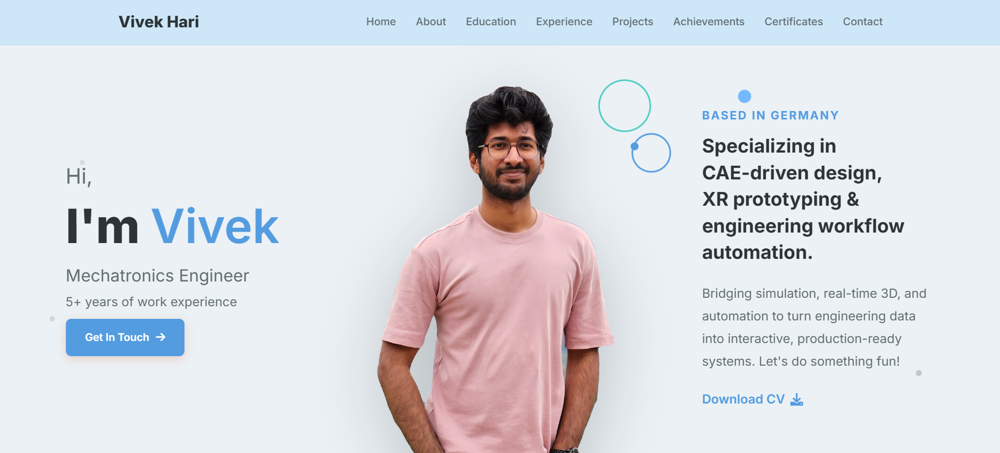

# Vivek Hari | Portfolio 🌐
> Welcome to my personal portfolio! This is a clean, modern, and responsive portfolio template designed for multi-disciplinary engineers. Show off your skills, projects, and experience in style.

> https://IndominusPsych.github.io

[](https://indominuspsych.github.io)
[](https://github.com/IndominusPsych/IndominusPsych.github.io/commits/main/)
[](https://www.linkedin.com/in/vivek619/)
[](http://badges.mit-license.org)

### Website Preview
<p align="center"> 
  <kbd>
    <a href="https://IndominusPsych.github.io" target="_blank">
  </a>
  </kbd>
</p>

## Features 📋
⚡️ Fully Responsive\
⚡️ Valid HTML5 & CSS3\
⚡️ Easy to Customize and Modify
⚡️ Smooth Navigation and Beautiful UI

## Installation & Deployment 📦
To get started with your own version of this portfolio, follow these simple steps:
- Clone the Repository: Clone the repository to your local machine using:
```
git clone https://github.com/IndominusPsych/IndominusPsych.github.io.git
```

- Modify the content in the <b>index.html</b> file to reflect your personal information, projects, and experience.
- Add or remove images from `IndominusPsych.github.io/assets/img/` directory as per your requirement.
- I highly recommend to use [Github Pages](https://create-react-app.dev/docs/deployment/#github-pages) to deploy the website the EASIEST WAY.
- To deploy your website, first you need to create github repository with name `<your-github-username>.github.io`. Please don't give any other name.
- Push the generated code to the `main` branch of this repository.

## Sections 📚
This portfolio includes the following sections:

✔️ Resume: A downloadable link to your resume.\
✔️ About Me: A brief introduction and background.\
✔️ Skills: Highlight your technical expertise.\
✔️ Education: Your academic credentials.\
✔️ Experience: Details of your professional journey.\
✔️ Academic Projects: Showcase your development projects.\
✔️ Achievements: Showcase your achievements.\
✔️ Certifications: Showcase your certifications.\
✔️ Contact Info: How people can reach you.

To view a live demo, visit the link above

## Tools Used 🛠️
* [<b>GitHub Pages</b>](https://create-react-app.dev/docs/deployment/#github-pages) - To host my static website (HTML, CSS, JS).

## License 📄
This project is licensed under the MIT License - see the [LICENSE.md](./LICENSE) file for details.
